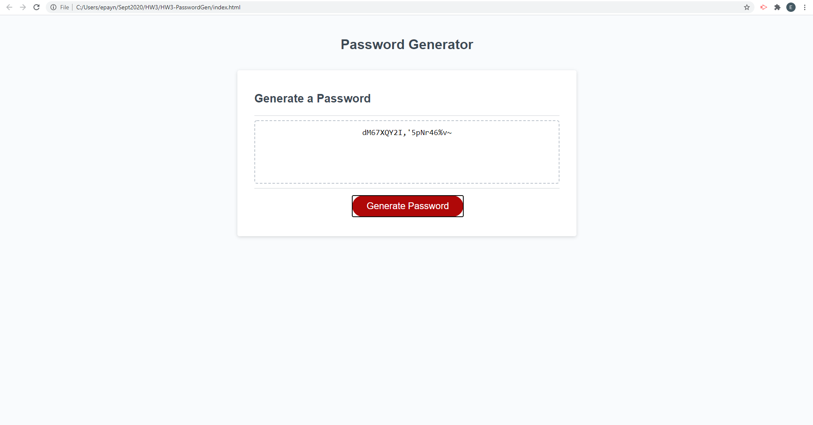

  # Password Generater

  ## Description
  This project's purpose is to generate a strong password based on user preferences. The application validates user input and makes sure that at least one character type option is selected, as well as the pasword length is between 8 and 128 characters. After the user chooses their preferences, they will be given a password matching their preferences.
   
  <a href="https://mcduderson.github.io/HW3-PasswordGen/">Deployed App</a>

  ## Table of Contents
  1. [Description](#description)
  2. [Installation](#installation)
  3. [Usage](#usage)
  4. [License](#license)
  5. [Contributing](#contributing)
  6. [Tests](#tests)
  7. [Questions](#questions)

  ## Installation
  No installation needed, please visit the deployed app or repo link if you would like to see the website/code.

  ## Usage
  

  ## License
  This application is licensed under the None license.

  ## Contributing
  This project is not open to contribution at this time.

  ## Tests
  No test suite, manual tests performed

  ## Questions
  <a href="https://github.com/Mcduderson">GitHub Profile</a>
   
  For questions I can be reached at e.payne000@gmail.com